Diffusion models have revolutionized generative modeling, particularly in producing high-quality images. Yet, when faced with complex prompts involving multiple objects or conditions, they often stumble: generated images might satisfy only part of a prompt or contain inconsistencies.

In our [ICML 2025 paper](https://arxiv.org/abs/2505.13740), we introduce **CompLift**—a lightweight, training-free rejection criterion using **lift scores**—to address this issue.

# Table of Contents:

1. [Sometimes, Compositional Prompts Break Diffusion Models](#-sometimes-compositional-prompts-break-diffusion-models)
3. [What is CompLift?](#-what-is-complift)
    1. [Lift Scores, Explained](#-lift-scores-explained)
    2. [Compositional Logic via Lift](#-compositional-logic-via-lift)
    3. [Efficient Implementation](#-efficient-implementation)
    4. [Connection to Classifier-Free Guidance](#-connection-to-classifier-free-guidance)
4. [Results](#-results)
5. [Lift in the Latent Space](#-lift-in-the-latent-space)
6. [Correlation between Lift Scores and CLIP Scores](#-correlation-between-lift-scores-and-clip-scores)
7. [Get Started](#-get-started)

## 🤔 Sometimes, Compositional Prompts Break Diffusion Models

Compositional prompts require satisfying multiple conditions simultaneously. Some diffusion models, e.g., Stable Diffusion, trained on rich datasets tend to focus on the objects mentioned with an earlier order in the prompt. As a result, given a prompt like:

> "a black car and a white clock"

The model might tend to generate a black car, and ignore the white clock. See the example below - here we have 100 samples generated by [Stable Diffusion XL](https://arxiv.org/abs/2307.01952). The 62 <span style="color: #2196F3;">blue-bordered</span> samples indicate that they satisfy the constraint to include a white clock, while the 38 <span style="color: #FF9800;">orange-bordered</span> samples do not include a white clock.

<style>
.grid-container {
  display: grid;
  grid-template-columns: repeat(10, 1fr);
  gap: 5px;
  max-width: 800px;
  margin: 20px auto;
  position: relative;
}

.grid-item {
  aspect-ratio: 1;
  background-color: #f0f0f0;
  border: 2px solid #ddd;
  border-radius: 4px;
  transition: all 0.3s ease;
  position: relative;
  background-size: cover;
  background-position: center;
  cursor: pointer;
}






.grid-item:nth-child({{ i | plus: 1 }}) {
  border-color: #2196F3;
}

.grid-item:nth-child({{ i | plus: 1 }}) {
  border-color: #FF9800;
}



.grid-item:hover {
  transform: scale(4);
  z-index: 2;
  box-shadow: 0 4px 15px rgba(0,0,0,0.2);
  border-radius: 8px;
  border-width: 3px;
}

/* Adjust transform origin based on position */
.grid-item:nth-child(10n) {
  transform-origin: left center;
}
.grid-item:nth-child(10n+1) {
  transform-origin: right center;
}
.grid-item:nth-child(-n+10) {
  transform-origin: center bottom;
}
.grid-item:nth-child(n+91) {
  transform-origin: center top;
}

/* Generate background-image rules for all 100 items */

.grid-item:nth-child({{ i | plus: 1 }}) {
  background-image: url('{{ site.baseurl }}/images/{{ i }}.jpg');
}

</style>

<div class="grid-container">
  
    
    <div class="grid-item" data-label="{{ label }}"></div>
  
</div>

Some previous works, e.g., [Attend & Excite](https://arxiv.org/abs/2301.13826), hypothesize that this happens because the model is biased towards some parts of the prompt, while ignoring others.

Our goal is to design a **rejection criterion** that can detect whether a generated sample satisfies each component of a compositional prompt, and reject it if it does not.

## 🚀 What is CompLift?

**CompLift** is a plug-and-play resampling technique that checks if a generated sample truly satisfies a prompt—**without retraining or using any extra models**. It leverages a classic statistical idea: **lift scores**.

### 🔍 Lift Scores, Explained

Lift measures how much a condition $$c$$ influences the probability of generating a sample $$x$$. Formally:

$$
\begin{equation}
\text{lift}(x|c) = \log\frac{p(x|c)}{p(x)} \tag{1}
\label{eqn:lift}
\end{equation}
$$

In practice, we show that we can approximate Eq. \eqref{eqn:lift} using the internal denoising predictions of the diffusion model itself. Similar techniques can be found in [Diffusion Classifier](https://diffusion-classifier.github.io/).

$$
\begin{equation}
\text{lift}(x|c) \approx \mathbb{E}_{t,\epsilon}\{||\epsilon-\epsilon_\theta(x_t, \varnothing)||^2-||\epsilon-\epsilon_\theta(x_t, c)||^2\} \tag{2}
\label{eqn:lift-approx}
\end{equation}
$$

Note:
- $$\epsilon_\theta$$ is the diffusion model
- $$t$$ is randomly sampled diffusion steps
- $$\epsilon \sim \mathcal{N}(0, I)$$ is the randomly sampled noise
- $$x_t$$ is the sample at step $$t$$, which is a noisy version of $$x_0$$

Intuitively, Eq. \eqref{eqn:lift-approx} means:

> If a sample aligns with the condition, the model should be **better at denoising it** when given that condition.

This allows us to check conditions *after* generation, and reject samples that don't satisfy them. Note that this is **training-free** and **does not require any extra models**.

### 🧠 Compositional Logic via Lift

CompLift handles logical combinations of conditions:

- **AND (Product)**: Accept only if all subconditions have positive lift.
- **OR (Mixture)**: Accept if *any* subcondition has positive lift.
- **NOT (Negation)**: Reject if a subcondition is satisfied.

<div style="display: table; margin-left: auto; margin-right: auto;">
  <table class="math-table" style="margin: 0px auto; margin-left: auto; margin-right: auto;">
    <thead>
      <tr>
        <th>Type</th>
        <th>Algebra</th>
        <th>Acceptance Criterion</th>
      </tr>
    </thead>
    <tbody style="text-align: center; margin-left: auto; margin-right: auto;">
      <tr>
        <td>Product</td>
        <td>\(c_1 \wedge c_2\)</td>
        <td>\(\min_{i\in[1,2]}\text{lift}(x|c_i)> 0\)</td>
      </tr>
      <tr>
        <td>Mixture</td>
        <td>\(c_1 \vee c_2\)</td>
        <td>\(\max_{i\in[1,2]}\text{lift}(x|c_i)> 0\)</td>
      </tr>
      <tr>
        <td>Negation</td>
        <td>\(\neg c_1\)</td>
        <td>\(\text{lift}(x|c_1)\leq 0\)</td>
      </tr>
    </tbody>
  </table>
</div>

<p style="text-align: center; font-size: 0.9em;">
  <b>Table 1:</b> Examples of composition rules for multiple conditions.
</p>

This compositional approach lets us flexibly combine prompts into logical structures! We call this compositional criteria as **CompLift**. Here we show some examples in 2D synthetic tasks. Here, we use the [Composable Diffusion](https://arxiv.org/abs/2406.00003) as the baseline. `+ CompLift` means we use CompLift to reject the samples that do not satisfy the criteria among the Composable Diffusion samples.

<div style="margin: 20px 0;">
    <div style="display: flex; justify-content: space-between; align-items: center; margin-bottom: 20px;">
        <div style="flex: 1; text-align: center;">
            <span style="line-height: 24px;">Component A</span>
        </div>
        <div style="flex: 0.2; text-align: center;"></div>
        <div style="flex: 1; text-align: center;">
            <span style="line-height: 24px;">Component B</span>
        </div>
        <div style="flex: 0.2; text-align: center;"></div>
        <div style="flex: 1; text-align: center;">
            <label style="display: inline-flex; align-items: center; gap: 2px;">
                <input type="checkbox" checked onclick="toggleVisibility('gt')" style="margin: 0;"> Ground Truth
            </label>
        </div>
        <div style="flex: 0.2; text-align: center;"></div>
        <div style="flex: 1; text-align: center;">
            <label style="display: inline-flex; align-items: center; gap: 2px;">
                <input type="checkbox" checked onclick="toggleVisibility('cd')" style="margin: 0;"> Composable Diffusion
            </label>
        </div>
        <div style="flex: 0.2; text-align: center;"></div>
        <div style="flex: 1; text-align: center;">
            <label style="display: inline-flex; align-items: center; gap: 2px;">
                <input type="checkbox" checked onclick="toggleVisibility('cl')" style="margin: 0;"> + CompLift
            </label>
        </div>
    </div>

    <h4 style="text-align: center; margin: 20px 0 10px;">Product Example</h4>
    <div style="display: flex; justify-content: space-between; align-items: center; margin-bottom: 10px;">
        <div style="flex: 1;">
            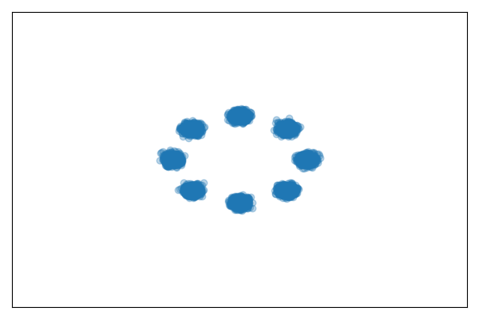
        </div>
        <div style="flex: 0.2; text-align: center;">
            <span style="font-size: 24px; font-weight: bold;">\(\times\)</span>
        </div>
        <div style="flex: 1;">
            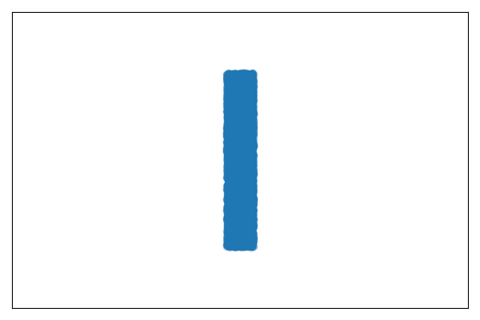
        </div>
        <div style="flex: 0.2; text-align: center;">
            <span style="font-size: 24px; font-weight: bold;">=</span>
        </div>
        <div style="flex: 1;" id="gt-product">
            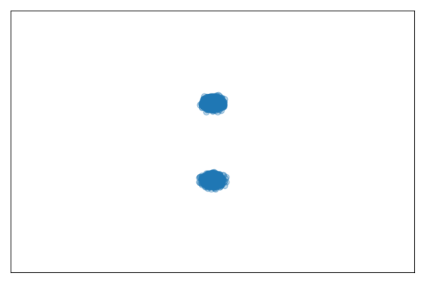
        </div>
        <div style="flex: 0.2; text-align: center;">
            <span style="font-size: 24px; font-weight: bold;"> </span>
        </div>
        <div style="flex: 1;" id="cd-product">
            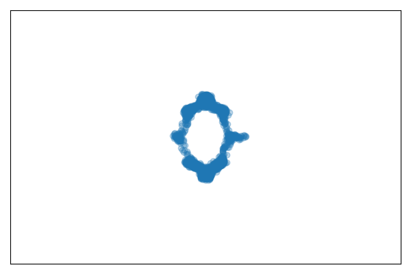
        </div>
        <div style="flex: 0.2; text-align: center;">
            <span style="font-size: 24px; font-weight: bold;"> </span>
        </div>
        <div style="flex: 1;" id="cl-product">
            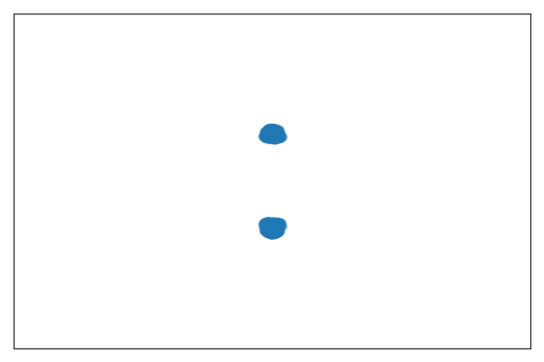
        </div>
    </div>

    <h4 style="text-align: center; margin: 20px 0 10px;">Mixture Example</h4>
    <div style="display: flex; justify-content: space-between; align-items: center; margin-bottom: 10px;">
        <div style="flex: 1;">
            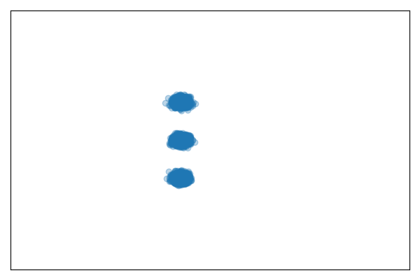
        </div>
        <div style="flex: 0.2; text-align: center;">
            <span style="font-size: 24px; font-weight: bold;">\(+\)</span>
        </div>
        <div style="flex: 1;">
            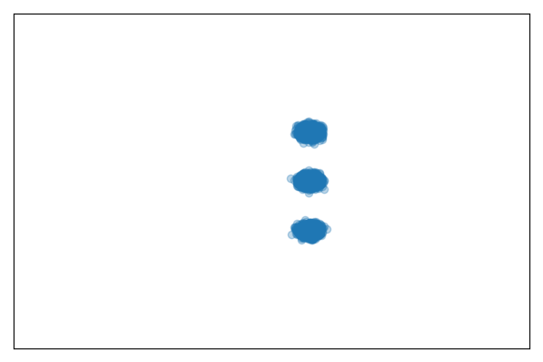
        </div>
        <div style="flex: 0.2; text-align: center;">
            <span style="font-size: 24px; font-weight: bold;">=</span>
        </div>
        <div style="flex: 1;" id="gt-sum">
            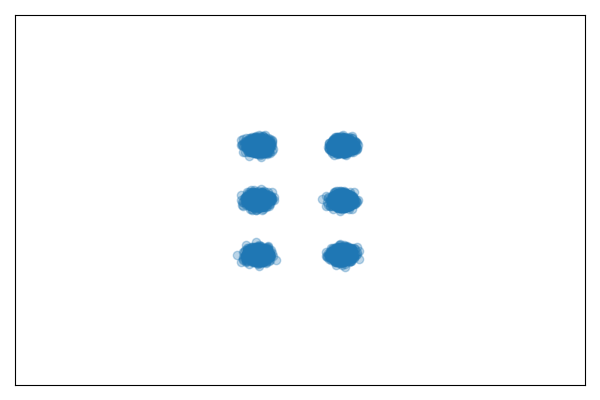
        </div>
        <div style="flex: 0.2; text-align: center;">
            <span style="font-size: 24px; font-weight: bold;"> </span>
        </div>
        <div style="flex: 1;" id="cd-sum">
            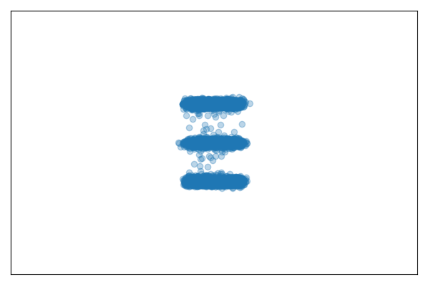
        </div>
        <div style="flex: 0.2; text-align: center;">
            <span style="font-size: 24px; font-weight: bold;"> </span>
        </div>
        <div style="flex: 1;" id="cl-sum">
            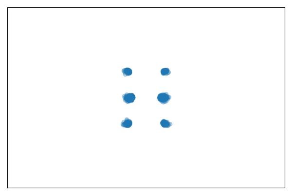
        </div>
    </div>

    <h4 style="text-align: center; margin: 20px 0 10px;">Negation Example</h4>
    <div style="display: flex; justify-content: space-between; align-items: center; margin-bottom: 10px;">
        <div style="flex: 1;">
            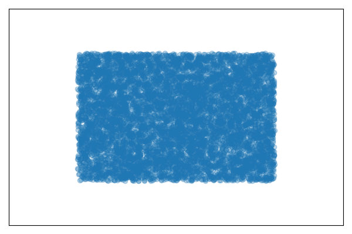
        </div>
        <div style="flex: 0.2; text-align: center;">
            <span style="font-size: 24px; font-weight: bold;">\(-\)</span>
        </div>
        <div style="flex: 1;">
            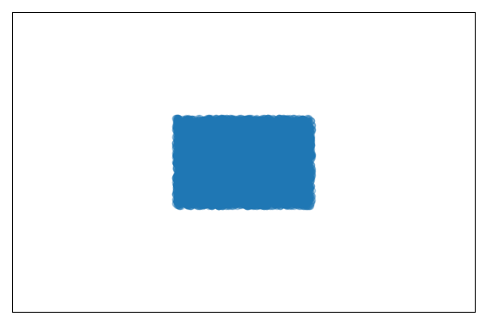
        </div>
        <div style="flex: 0.2; text-align: center;">
            <span style="font-size: 24px; font-weight: bold;">=</span>
        </div>
        <div style="flex: 1;" id="gt-neg">
            
        </div>
        <div style="flex: 0.2; text-align: center;">
            <span style="font-size: 24px; font-weight: bold;"> </span>
        </div>
        <div style="flex: 1;" id="cd-neg">
            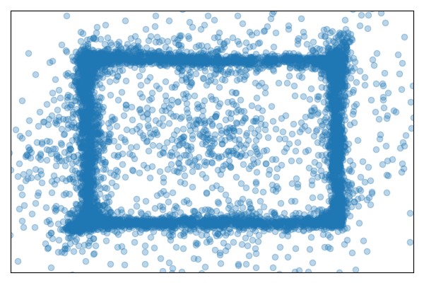
        </div>
        <div style="flex: 0.2; text-align: center;">
            <span style="font-size: 24px; font-weight: bold;"> </span>
        </div>
        <div style="flex: 1;" id="cl-neg">
            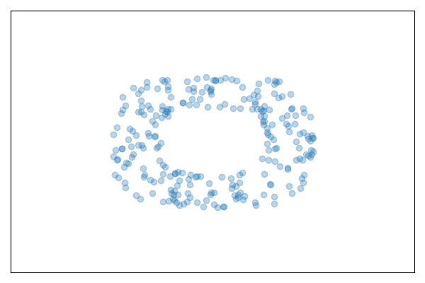
        </div>
    </div>
</div>

<script>
function toggleVisibility(id) {
    const element = document.getElementById(id + '-product');
    const elementSum = document.getElementById(id + '-sum');
    const elementNeg = document.getElementById(id + '-neg');

    if (element.style.visibility === 'hidden') {
        element.style.visibility = 'visible';
        elementSum.style.visibility = 'visible';
        elementNeg.style.visibility = 'visible';
    } else {
        element.style.visibility = 'hidden';
        elementSum.style.visibility = 'hidden';
        elementNeg.style.visibility = 'hidden';
    }
}
</script>

### ⚙️ Efficient Implementation

[In our paper](https://arxiv.org/abs/2505.13740), we investigate several design choices for CompLift. A TL;DR version is:

1. Sharing sampled $$(\epsilon, t)$$ pairs between the estimation of $$p(x)$$ and $$p(x \\| c)$$ is most efficient.
2. Importance sampling on $$t$$ is required when the original diffusion model $$\epsilon_\theta$$ is trained with importance sampling.
3. We can reuse the calculation of $$\epsilon_\theta(x_t, c)$$, that are computed when $$x$$ is generated, to save compute when estimating $$\text{lift}$$.

### 📝 Connection to Classifier-Free Guidance

One would notice that the above implementation is similar to the [classifier-free guidance technique (CFG)](https://arxiv.org/abs/2207.12598) - we have $$\epsilon_\theta(x_t, c)$$ and we compare it with $$\epsilon_\theta(x_t, \varnothing)$$. In the appendix of our paper, we show that they are dual to each other from the Lagrangian perspective.

CompLift solves the *primal problem* - the sampler tries to generate samples that satisfy the ground truth condition.

$$
\begin{aligned}
& x_0 \sim p_{\text{generator}}(x_0), \quad \text{s.t. } p(x_0 \mid c_i) > p(x_0), \quad \forall c_i, \\
\Leftrightarrow \quad & x_0 \sim p_{\text{generator}}(x_0), \quad \text{s.t. } \text{lift}(x_0 \mid c_i) > 0, \quad \forall c_i.
\end{aligned}
$$

CFG / Composable Diffusion solves the *dual problem* - the sampler tries to generate samples that are close to the ground truth condition and keeps a balance using the Lagrangian coefficient $$\lambda_i$$.

$$
\begin{aligned}
& \mathcal{L}(x_0, \lambda) = \log p_{\text{generator}}(x_0) + \sum_{c_i} \lambda_i \Bigl( \log p(x_0 \mid c_i) - \log p(x_0) \Bigr), \quad \lambda_i \geq 0, \\
\Rightarrow & \nabla_{x_t} \mathcal{L}(x_0, \lambda) \approx \epsilon_\theta(x_t, \varnothing) + \sum_{c_i} \lambda_i \Bigl( \epsilon_\theta(x_t, c_i) - \epsilon_\theta(x_t, \varnothing) \Bigr), \quad \lambda_i \geq 0.
\end{aligned}
$$

Note:
- CFG / Composable Diffusion often sets the Lagrangian coefficient $$\lambda_i$$ as a fixed weight value $$w$$.
- The choice of $$p_{\text{generator}}(x_0)$$ can vary. CompLift mainly uses $$p_{\text{generator}}(x_0)$$ as $$p_\theta(x_0, c_{\text{prompt}})$$, while CFG / Composable Diffusion often regards $$p_{\text{generator}}(x_0)$$ as $$p_\theta(x_0, \varnothing)$$.

## 🧪 Results

We evaluate CompLift on:

- 🎨 2D synthetic tasks
- 🧱 CLEVR object positioning
- 🖼 Text-to-image generation (SD 1.4/2.1/XL)

Across the board, CompLift significantly improves prompt alignment without harming quality. More details can be found in [our paper](https://arxiv.org/abs/2505.13740).

| Task           | Metric                | Baseline | +CompLift |
|:----------------:|:------------------------:|:----------:|:-----------:|
| 2D Synthetic Task    | Accuracy               | 45.0%    | **92.9%** |
| CLEVR Position (5 objects) | Accuracy  | 78.7%    | **90.3%** |
| SD 2.1         | CLIP Score | 0.342    | **0.352** |

Here we show some examples of the generated samples with Stable Diffusion XL.

## 🔬 Lift in the Latent Space

To handle fine-grained image prompts, we compute lift *per pixel* in the latent space, allowing us to detect whether each object is truly present. This even helps in understanding *which* part of the image aligns with each prompt component.

## 📊 Correlation between Lift Scores and CLIP Scores

## 🧰 Get Started

Want to try it out?

```bash
git clone https://github.com/rainorangelemon/complift
cd complift
python run_lift.py --prompt "a black car and a white clock"
```

## 🧩 Final Thoughts

CompLift shows how diffusion models can be made **compositional**—by introspecting their own denoising behavior. It's simple, elegant, and practical.

While we've focused on image generation, the principles behind lift scores may apply to **video, music, or even language generation** in the future.

## 📄 Paper

> [Chenning Yu](https://rainorangelemon.github.io/) and [Sicun Gao](https://scungao.github.io/). *Improving Compositional Generation with Diffusion Models Using Lift Scores*. ICML 2025. [[ArXiv](https://arxiv.org/abs/2505.13740)] [[GitHub](https://github.com/rainorangelemon/complift)]